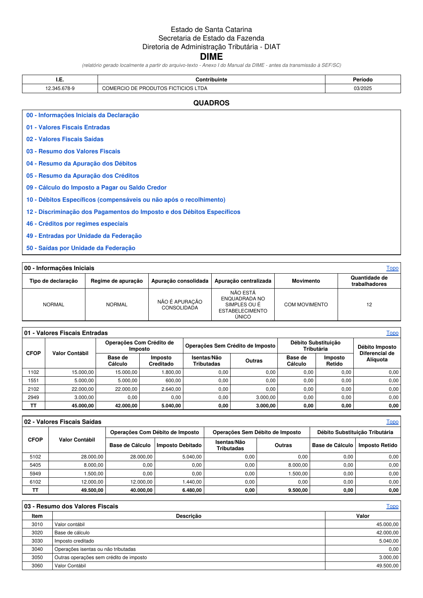

# Conversor DIME/GIA-SC → DIME Detalhada

[](https://github.com/andersonmoegel/dime-sc-conversor/actions/workflows/pylint.yml)
[](LICENSE)

Converte o arquivo-texto de layout fixo da DIME/GIA-SC (o arquivo que o contabilista transmite à SEF/SC) em um relatório no formato **DIME Detalhada** — o mesmo extrato exibido pelo sistema S@T em `sat.sef.sc.gov.br`. Layout dos registros implementado a partir do **Manual Consolidado da DIME (v31, 22/03/2024)**, item 5 — *Layout dos Registros* — e validado campo a campo contra uma declaração real.



## Arquivos

| Arquivo | O que é |
|---|---|
| `dime_txt_to_detalhada.py` | Motor de leitura/validação do arquivo-texto. Roda por linha de comando e gera **HTML** e/ou **texto simples**. Não tem dependências externas. |
| `dime_desktop.py` | Programa **desktop** (janela gráfica, tkinter) que reaproveita o motor acima e gera **PDF nativo** (biblioteca `reportlab`), no layout visual do extrato oficial. |
| `README.md` | Este arquivo. |

Os dois scripts precisam estar na mesma pasta (`dime_desktop.py` importa `dime_txt_to_detalhada.py`).

## O que é lido do arquivo-texto

Registros suportados (tipo → quadro da DIME):

`20` Contabilista · `21` Quadro 00 (dados iniciais) · `22`/`23` Quadros 01/02 (valores fiscais entradas/saídas, por CFOP) · `24`–`26` Quadros 03/04/05 (resumos) · `30`/`31`/`32` Quadros 09/10/11 · `33` Quadro 12 (pagamentos) · `35` Quadro 14 · `36`/`37` Quadros 15/16 (fundos) · `41`/`42` Quadros 41/42 · `46` Quadro 46 (créditos por regime especial) · `47`–`51` Quadros 47–51 · `80`–`85` Quadros 80–85 · `98`/`99` Encerramento.

Cada declaração do arquivo (delimitada pelos registros `21` ... `98`) vira um relatório separado. Um mesmo arquivo pode conter várias declarações/contribuintes — todas são processadas.

## Instalação

```bash
pip install -r requirements.txt
```

(`tkinter`, usado na janela do programa desktop, já vem incluído no instalador oficial do Python para Windows.)

## Uso

### Linha de comando (gera HTML/texto)

```bash
python dime_txt_to_detalhada.py arquivo.txt -o pasta_saida --txt
```

### Programa desktop (gera PDF)

Com janela gráfica:

```bash
python dime_desktop.py
```

Sem abrir janela (linha de comando, útil para automação):

```bash
python dime_desktop.py arquivo.txt pasta_saida
```

Cada declaração gera um arquivo `DIME_DETALHADA_<IE>_<período>.pdf`.

## Gerando um executável (.exe) para Windows

```powershell
pip install pyinstaller
pyinstaller --onefile --windowed --name "Conversor DIME" dime_desktop.py
```

O `.exe` final fica em `dist\Conversor DIME.exe` — arquivo único, sem console de fundo.

> **Importante:** rode o comando acima em uma pasta com caminho **curto** (ex.: `C:\dime`). Caminhos muito longos (como pastas profundas do OneDrive/AppData) fazem o PyInstaller falhar no Windows com `WinError 122`. Se mesmo assim der erro, adicione a pasta como exceção no Windows Defender antes de tentar de novo.

## Fidelidade ao layout oficial

O relatório em PDF reproduz o extrato oficial: cabeçalho (Estado de Santa Catarina / Secretaria da Fazenda / DIAT / DIME), tabela com I.E./Contribuinte/Período, caixa "QUADROS" com links internos, e cada quadro como uma caixa com título + link "Topo", incluindo os cabeçalhos mesclados dos Quadros 01, 02, 49 e 50. Só são exibidos os quadros que realmente têm lançamento na declaração, como no extrato original.

Validação feita comparando **todos os valores monetários** de um PDF gerado pelo conversor contra o PDF oficial da mesma declaração: 100% de correspondência.

## Limitações conhecidas

- Quadros pouco usuais (41, 42, 47, 48, 51, 80–85) são lidos e somados corretamente, mas exibidos com um rótulo genérico ("Item NNN") em vez da descrição oficial completa — esses quadros raramente aparecem em declarações normais.
- Campos como "Data de Transmissão" e "Número da Declaração" não existem no arquivo-texto (são atribuídos pela SEF só depois do envio), por isso não aparecem no relatório.
- Esta ferramenta gera um **relatório de conferência local**, a partir do arquivo que seria transmitido — ela não substitui nem realiza a transmissão da DIME à SEF/SC.

## Licença

Distribuído sob a licença [MIT](LICENSE).
